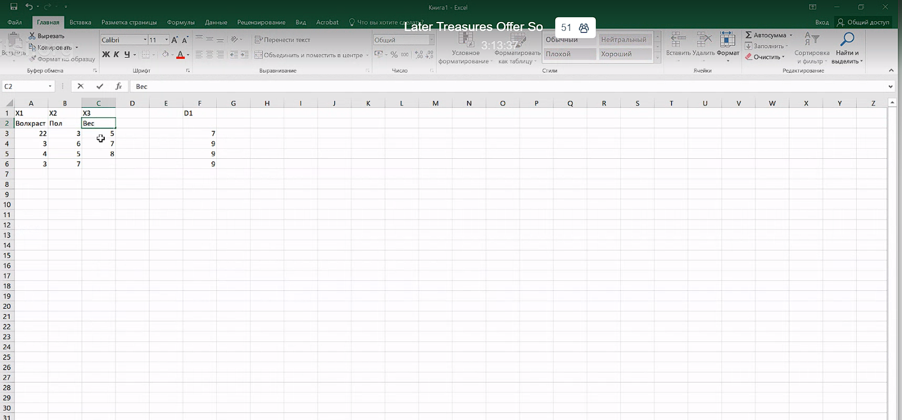

# Lecture 4

03.06.20

## ДЗ

- прислать датасет
  - в Excel
    - общее (исходное) множество
      - столбцы - X1, X2, ..., D
      - разбить на множества (тестовое - желтым, обучающее - белым)
    - две страницы - обучающее и тестовое множества

