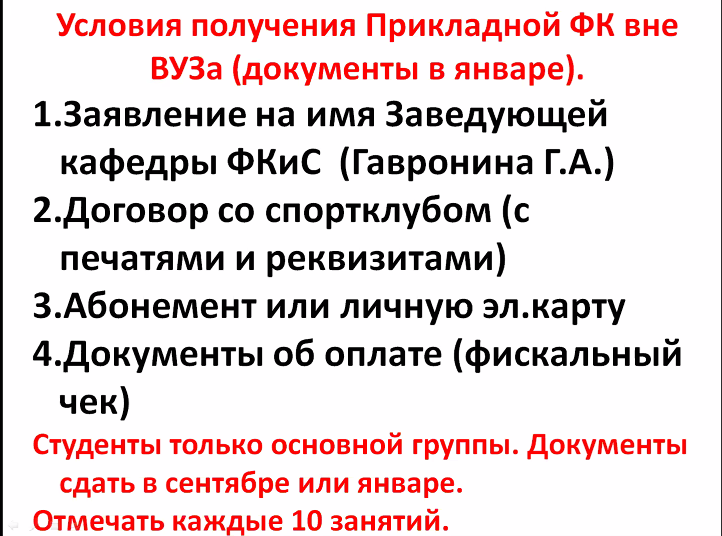
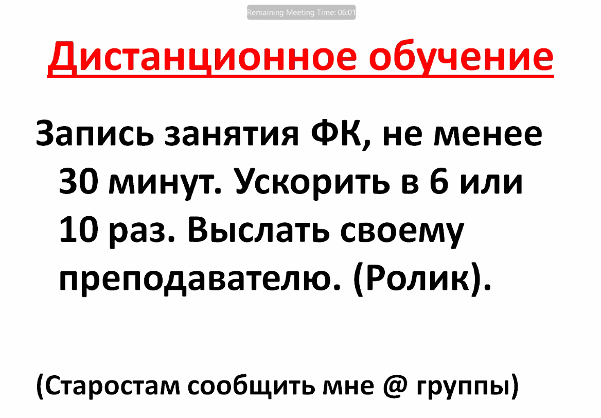

# Физическая культура + прикладная физическая культура

## Физическая культура

1 лекция + 6 семинаров

## Прикладная физическая культура

Раз в неделю в среду в 15:40 (14 занятий). Можно ходить хоть каждый день.

### Вне вуза

Вне ВУЗа - ровно месяц на то, чтобы принести документы.

Можно отметить сразу все 14 занятий за триместр.

Все документы нести Гуськовой Н. Н. Она принимает на лыжной базе, расписание пока неизвестно. Возможно, придется отмечаться у преподавателя, который будет вести физическую культуру (на семинаре) - надо уточнить.

### Дистанционное обучение

Высылать своему преподавателю. В случае занятий вне вуза - Гуськовой Н. Н. (или преподавателю, ведущему семинары).
