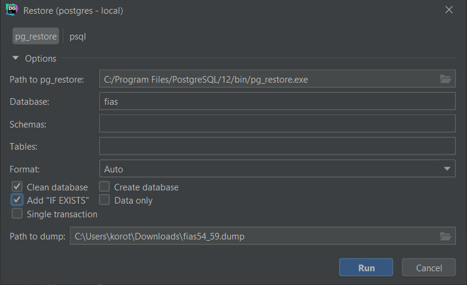

# Лаба 6

21.02.20

- [Лаба 6](#Лаба-6)
  - [Исключения](#Исключения)
  - [Представления](#Представления)
    - [Локальные представления](#Локальные-представления)
    - [Рекурсивные представления](#Рекурсивные-представления)
  - [information schema](#information-schema)
  - [pg_catalog](#pg_catalog)
  - [fias](#fias)

## Исключения

[1](res/lab6/script1.sql)

## Представления

Аналогично #define.

Могут быть обновляемыми и модифицированными.

Если на основе представления создано другое представление, придется удалять их каскадом.

[1](res/lab6/script2.sql)
[2](res/lab6/script3.sql)

### Локальные представления

[1](res/lab6/script5.sql)

### Рекурсивные представления

Выведем полные названия.

При следующем шаге будут соединяться только новые строки.

[1](res/lab6/script6.sql)

## information schema

Каким образом можно добраться до метаданных БД и узнать ее содержимое.

Стандартизована и переносима между различными БД.

[1](res/lab6/script4.sql)

## pg_catalog

Специфична для PostgreSQL.

## fias

