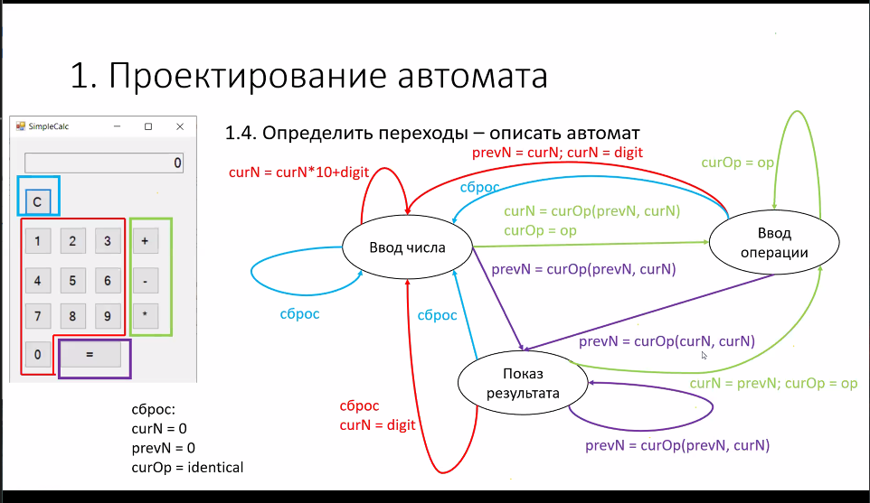

# Лекция 11

19.03.20

## Автоматное программирование

### 1. Проектирование автомата

1. Выделить вычислительные и управляющие переменные (состояния).
   1. Вычислительные:
      1. Текущее число (curN)
      2. Текущая операция (curOp)
      3. Предыдущее число (prevN)
   2. Управляющие:
      1. Состояние (state)
2. Выделить входные сигналы:
   1. Нажатие кнопки с цифрой
   2. Нажатие кнопки операции
   3. Нажатие кнопки "="
   4. Нажатие кнопки сброса
3. Выделить выходные сигналы
   1. Число на дисплее
4. Определить переходы - описать автомат

### 2. Реализация автомата
